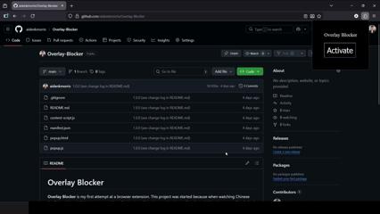

# Overlay Blocker

**Overlay Blocker** is my first attempt at a browser extension. 
This project was started because when watching Chinese YouTube videos, I didn't want to accidentally cheat my listening practice by reading the subtitles that were often baked into the video. This overlay allows me to cover up the captions without placing a physical object on my screen.

For general use, Overlay Blocker creates an adjustable overlay that blocks part of the current webpage.

## Languages / Tools Used
- HTML/CSS/JavaScript

## Where to Install
- [Firefox](https://addons.mozilla.org/en-US/firefox/addon/overlay-blocker/)
- Chrome (coming soon...)

## Change Log
**0.0.0** - July 2025
- Initial prototype

**1.0.0** - March 2026
- First functional browser extension version
- Adjusted minimum overlay and drag zone sizes
- Updated mouse "glow" effect
- Simplified the pop-up menu